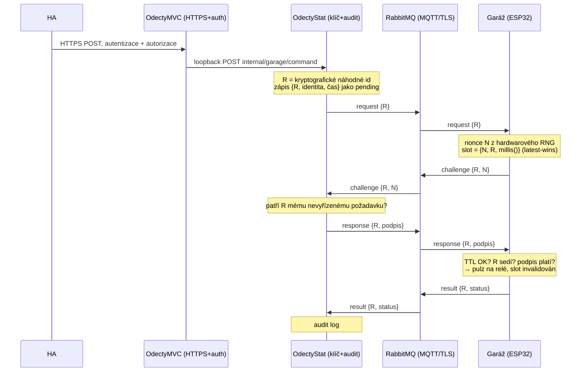

# Bezpečné otevírání garáže — jak to funguje

Garážová vrata se neotevírají povelem po MQTT. Otevření prochází challenge–response
handshakem, jehož podpisový klíč nikdy neopustí OdectyStat. Tento dokument popisuje
hotový stav, ne plán.

Provozní firmware je [`src/ESP32`](../src/ESP32). Serverová strana je v repu
[Odecty](https://github.com/Zefek/Odecty), služba OdectyStat.

---

## 1. Proč to není jen MQTT povel

Otevření vrat je **fyzická akce**. Kdo umí publikovat na správný topic, dostane se do
domu — a to je jiná kategorie než přečíst si teplotu.

MQTT běží přes TLS na portu 8883, takže odposlech ani injektáž z lokální sítě nehrozí.
To ale nestačí:

- TLS chrání **kanál**, ne **autorizaci**. Kdokoli s platnými credentials k brokeru
  může publikovat cokoli.
- Broker je sdílená infrastruktura. Kompromitovaný broker nebo uniklé heslo jednoho
  zařízení by při jednoduchém povelu znamenaly otevřená vrata.

Proto je bezpečnost otevírání postavená tak, aby **nezávisela na tom, že je MQTT
důvěryhodné**. Po sběrnici jde jen nonce a podpis nad ním; ani jedno se nedá zneužít.

## 2. Princip

Ověřovatel si sám volí challenge a autorita ji podepisuje:

- **Nonce volí garáž**, ne server. Kdyby ho volil server, dala by se garáži podstrčit
  odchycená dvojice (nonce, podpis).
- **Podepisuje se na serveru.** Klíč leží v OdectyStat, ne v garáži a ne v Home
  Assistantu.
- **Vstup se autentizuje přes HTTPS**, kde se autentizace a autorizace dá udělat
  poctivě.
- **Rozhodnutí „požadavek je autentizovaný" teče jen loopbackem**, nikdy po MQTT.
- **Tajemství nikdy neletí po drátě.** Po MQTT jde nonce a podpis, ne klíč.

Výsledkem jsou nezávislé vrstvy, z nichž žádná nesdílí tajemství s ostatními:

| Vrstva | Zajišťuje | Kde |
|---|---|---|
| WPA2/3 | přístup na síť | WiFi |
| TLS | důvěrnost a integrita kanálu | broker :8883 |
| ACL na brokeru | oddělení topiců zařízení | RabbitMQ |
| HTTPS + auth | kdo smí *požádat* | OdectyMVC |
| Autorizace | tato identita smí otevřít garáž | OdectyMVC |
| Podpisový klíč | odolnost proti forgery | OdectyStat |
| Nonce + verify | odolnost proti replay | garáž |

## 3. Aktéři

| Aktér | Role | Drží tajemství |
|---|---|---|
| **Home Assistant** | klient — spustí požadavek, zobrazí stav | jen svůj HTTPS credential. **Nepodepisuje** |
| **OdectyMVC** | veřejná HTTPS brána, autentizace + autorizace | credential store |
| **OdectyStat** | podepisovatel, orchestrátor handshaku, audit | **podpisový klíč** |
| **Garáž (ESP32)** | ověřovatel — vydá nonce, ověří podpis, sepne relé | ověřovací klíč (tentýž `K`) |

Zásadní je nezaměnit dva typy kanálů:

- **Důvěryhodný:** HA → HTTPS → OdectyMVC → **loopback** → OdectyStat. Tudy teče
  rozhodnutí „požadavek je autentizovaný".
- **Nedůvěryhodný:** OdectyStat ↔ RabbitMQ ↔ garáž. Tudy jde jen challenge a podpis,
  obojí chráněné kryptograficky.

Loopback není jen konvence — `GarageController` ho **vynucuje v kódu**:

```csharp
var remote = HttpContext.Connection.RemoteIpAddress;
if (remote == null || !IPAddress.IsLoopback(remote))
{
    return Forbid();
}
```

Kdyby signál „autentizováno" šel po RabbitMQ, útočník na sběrnici by ho zfalšoval a
Stat by podepsal bez reálného požadavku.

## 4. Tok protokolu



**Proč korelační id `R`:** kdyby stačilo „byl nějaký požadavek v okně", útočník by
vyvolal token přesně ve chvíli cizího legitimního požadavku a Stat by mu ho požehnal.
Stat proto podepíše jen token, který dorazí pro **jeho konkrétní vlastní** `R`.

## 5. Formát zpráv

Všechny payloady jsou **binární, little-endian**. Názvy topiců jsou v `config.h`.

| Topic | Směr | Délka | Obsah |
|---|---|---|---|
| `GARAGE_OPEN_REQUEST` | Stat → garáž | 4 B | `uint32 R` |
| `GARAGE_OPEN_CHALLENGE` | garáž → Stat | 12 B | `uint32 R` + `nonce[8]` |
| `GARAGE_OPEN_RESPONSE` | Stat → garáž | 20 B | `uint32 R` + `podpis[16]` |
| `GARAGE_OPEN_RESULT` | garáž → Stat | 5 B | `uint32 R` + `uint8 status` |

Status: `1` = opened, `2` = expired, `3` = badsig. Server k tomu přidává vlastní
`timeout`, když result nikdy nedorazí.

**Odpověď nenese nonce**, na rozdíl od původního návrhu. Není potřeba: garáž
přepočítá podpis nad noncem, který sama drží, takže nesoulad se projeví jako neplatný
podpis. Kontrola rovnosti nonce je v té verifikaci obsažená a čtyři bajty se ušetří.

## 6. Stav na garáži

Garáž drží **jediný slot** — jeden živý nonce, žádná fronta. RTC není potřeba, stačí
relativní `millis()`.

```c
struct OpenSlot {
  uint8_t nonce[GARAGE_NONCE_LEN];
  uint32_t issuedAt;
  uint32_t correlationId;
  bool valid;
};
```

**Vydání nonce je latest-wins.** Každá nová žádost slot přepíše. Flood tak jen levně
přepisuje jeden slot — nezabere paměť a nikdy se neodmítne nová žádost. Odmítání by
útočníkovi dalo levný DoS na vlastní vrata.

**Ověření odpovědi** vyžaduje současně: slot je obsazený, `millis() - issuedAt <= TTL`
v neznaménkové aritmetice (bezpečné i přes přetečení `millis()`), `R` sedí na slot, a
podpis platí. Po úspěchu se slot invaliduje, takže **tentýž podpis nejde přehrát ani
uvnitř TTL**.

Porovnání podpisu je v konstantním čase:

```c
uint8_t diff = 0;
for (uint8_t i = 0; i < GARAGE_SIG_LEN; i++) {
  diff |= mac[i] ^ respBuf[4 + i];
}
```

Nonce pochází z hardwarového generátoru ESP32 (`esp_fill_random()`), ne z odvozené
entropie.

## 7. Kryptografie

Symetrický **HMAC-SHA256** z mbedtls, které je v obrazu stejně přítomné kvůli TLS.

Podepisuje se `R ∥ nonce ∥ "open"` — svázání s korelačním id, noncem i záměrem, aby
klíč nešel zneužít na jiný povel. Výsledných 32 bajtů se zkracuje na
`GARAGE_SIG_LEN`.

Klíč se do firmwaru dostává jako `SigningKeyHex` v `secret.h` a při startu se
kontroluje jeho délka i formát. **Při neplatném klíči firmware selže bezpečným
směrem:** `signingKey` zůstane vynulovaný, žádný podpis se netrefí a každý pokus
skončí `BADSIG`. Vrata se neotevřou.

Správnost implementace se ověřuje při každém startu testovacím vektorem z RFC 4231:

```
HMAC selftest OK
PROTOKOL: nonce=8 B, klic=16 B, podpis=16 B, TTL=20000 ms
```

Asymetrická varianta (Ed25519) se nepoužívá. Dump flashe garáže tedy prozradí `K` —
ale vyžaduje fyzický přístup ke garáži, a kdo ho má, otevře vrata i jinak.

## 8. Co to drží a co ne

**Brání se:**

- **Forgery** — bez podpisového klíče nevznikne platný povel. Klíč má jen OdectyStat.
- **Replay** — odchycený podpis je k ničemu, nonce je jednorázový a s krátkým TTL.
- **Injektáž do MQTT** — útočník může přimět garáž vydávat nonce, ale bez
  autentizovaného požadavku doručeného loopbackem se nic nepodepíše.
- **Kompromitace Home Assistanta** — umožní leda *požádat*, což se autorizuje
  a auditovává. HA podpisový klíč nedrží.
- **Brute-force credentialu** — řeší rate-limit a lockout na HTTPS endpointu.

**Nebrání se, vědomě:**

- **DoS dostupnosti od aktivního útočníka na MQTT.** Kdo aktivně injektuje na sběrnici,
  umí přepsat nonce v okně mezi vydáním a příchodem podpisu. Otevření selže a uživatel
  to zkusí znovu. Je to síťový problém — řeší se IoT VLAN a fyzickým fallbackem, ne
  kryptografií.
- **Fyzický dump flashe garáže** — viz výše.

Klíčová vlastnost: protokol **nikdy nezpůsobí falešné otevření**. Degraduje se jen
dostupnost.

## 9. Spolehlivost

**QoS není symetrická.** Garáž se přihlašuje k odběru s QoS 1, ale PubSubClient umí
publikovat jen QoS 0 — takže challenge a result jdou nepotvrzeně. Ztracená zpráva
znamená, že handshake nedoběhne, `GarageTimeoutService` požadavek označí jako
`timeout` a uživatel zmáčkne znovu. Původní návrh počítal s QoS 1 na všech nohách;
tohle je vědomé omezení knihovny, ne opomenutí.

**Požadavek je single-shot.** Žádné automatické opakování. Když uživatel legitimně
zmáčkne dvakrát, je to nový požadavek a latest-wins na garáži jen obnoví nonce.

**OTA neběží během handshaku.** `OtaAllowed()` vyžaduje zavřená vrata, žádný pohyb a
žádný rozpracovaný slot, takže se zařízení nerestartuje uprostřed otevírání.

**OdectyStat je v kritické cestě.** Restart služby znamená, že otevřít nejde — proto
zůstává klasický dálkový ovladač jako fyzický fallback.

## 10. Parametry

| Parametr | Kde | Hodnota |
|---|---|---|
| `GARAGE_NONCE_LEN` | `config.h` | 8 B (64 bit) |
| `GARAGE_KEY_LEN` | `config.h` | 16 B (128 bit) |
| `GARAGE_SIG_LEN` | `config.h` | 16 B (zkrácený HMAC) |
| `GARAGE_OPEN_TTL` | `config.h` | 20 000 ms |
| `SigningKeyHex` | `secret.h` | hex, `GARAGE_KEY_LEN * 2` znaků |
| `SignatureBytes` | `GarageSettings` na serveru | 16 |
| `SlotTtlSeconds` | `GarageSettings` na serveru | 20 |

Délky a TTL jsou nastavitelné prostředí od prostředí, ale **obě strany musí
souhlasit**. Nesoulad délky podpisu se projeví hláškou:

```
HANDSHAKE: response ma 20 B, cekano 24 (GARAGE_SIG_LEN=16)
```

Status kódy `1`/`2`/`3` jsou naopak výčet, který se nemění, a jsou zakompilované na
obou stranách.

## 11. Testování

[`tests/garage_open_test.py`](../tests/garage_open_test.py) zastoupí OdectyStat a
ověřuje, že firmware povel správně přijme i odmítne:

```
python garage_open_test.py            # platný podpis     -> OPENED
python garage_open_test.py --badsig   # prohozený bit     -> BADSIG
python garage_open_test.py --expire   # odpověď až po TTL -> EXPIRED
python garage_open_test.py --replay   # stejný podpis 2x  -> podruhé EXPIRED
```

Ty tři negativní scénáře jsou cennější než pozitivní — ověřují právě ty vlastnosti,
kvůli kterým protokol existuje. Nejcennější je `--replay`: je to jediný případ, kde
útočník nepotřebuje klíč, jen odposlech.

Skript čte konfiguraci i klíč z `config.h` a `secret.h`, takže testuje tutéž
konfiguraci, jaká je v zařízení. **Posílá skutečný povel k otevření** — spouštět jen
proti sketchi s testovacími topicy, nebo vědomě.

## 12. Co protokolem neteče

Stav vrat (`GARAGE_STATE`), teplota a diagnostika jdou po MQTT jako obyčejné retained
zprávy. Jsou to jen čtená data s nízkou citlivostí a autentizaci nepotřebují. Tímto
protokolem prochází **výhradně povel k otevření**.

Starý topic `GARAGE_CMD`, který otevíral vrata na jakoukoli příchozí zprávu, byl z
firmwaru odstraněn. Bez toho by celý protokol bylo možné obejít a nemělo by smysl ho
mít.
